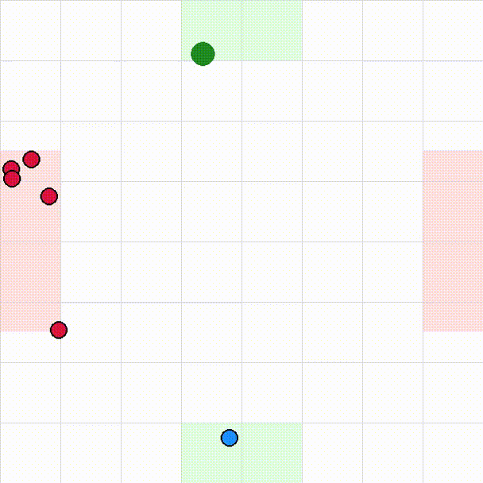

# Simple2DCross Environment

`Simple2DCross` is a Gymnasium environment for a 2D pedestrian navigation task. A single controlled agent must reach a goal while avoiding collisions with multiple uncontrolled pedestrians. Obstacle pedestrians move from left to right according to a built-in Social Force Model.

## Action Space

The action space is a continuous `Box(2,)` with values in `[-1, 1]`, representing the controlled agent's 2D velocity.

## Observation Space

The observation is a continuous vector of shape

```text
(6 + 4 × max(0, num_pedestrians − 1),)
```

and consists of:

* Agent position `(x, y)`
* Agent velocity `(vx, vy)`
* Position and velocity of all obstacle pedestrians
* Relative goal vector `(Δx, Δy)`

## Reward

The reward encourages efficient navigation while penalising collisions:

| Event            |                    Reward |
| ---------------- | ------------------------: |
| Distance to goal | `-0.1 × distance_to_goal` |
| Reach goal       |                   `+10.0` |
| Collision        |                    `-5.0` |

A collision occurs when the distance between the controlled agent and another pedestrian is less than `2 × collision_radius`, where `collision_radius = 0.15`.

## Episode End

An episode ends when one of the following occurs:

* The agent reaches the goal (within `0.2` units).
* The agent collides with another pedestrian.
* The maximum episode length (`200` steps) is reached.

## Rendering

The environment supports the following render modes:

* `human` — interactive visualisation using `pygame`
* `rgb_array` — returns the rendered frame as a NumPy array

Visual elements:

| Object                        | Colour    |
| ----------------------------- | --------- |
| Controlled agent              | Blue      |
| Obstacle pedestrians          | Red       |
| Goal                          | Green     |
| Agent start/goal regions      | Green box |
| Pedestrian start/goal regions | Red box   |

## Example

In this example, the agent is controlled by the built-in SFM.

```python
import gymnasium as gym

env = Simple2DCross(num_pedestrians=5, render_mode="human")

obs, info = env.reset()

terminated = truncated = False
while not (terminated or truncated):
    action = env.auto_action(repulsion_radius=1.0, repulsion_strength=2.0)
    obs, reward, terminated, truncated, info = env.step(action)
    env.render()

env.close()
```
